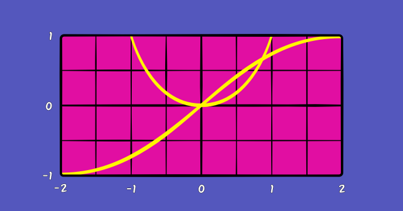

Math is cool! It is even cooler when your computer is helping you plot mathematical functions!

By implementing this program, you’ll not only get the chance to brush on your math skills, but you’ll also learn interesting coding and JavaScript concepts:

-	How to work with arrays
-	How to map values from one interval to another
-	How to use arrow functions (lambda expressions)
 
## Source code 
The JavaScript source code of this program can be found [here](sketches/program.js). To run it, you need to import it in the [codeguppy.com](https://codeguppy.com) online editor. Alternatively, you can use the source code in your p5.js sketches (advanced use). 
## Online version 
To see the code running, check the online playground at [https://codeguppy.com/code.html?t=fngraph](https://codeguppy.com/code.html?t=fngraph) 
## Next steps 
Please check [codeguppy.com](https://codeguppy.com) for many other fun JavaScript programs and games for beginners. To stay up to date with CodeGuppy development please follow [@codeguppy](https://twitter.com/codeguppy) on Twitter.  
